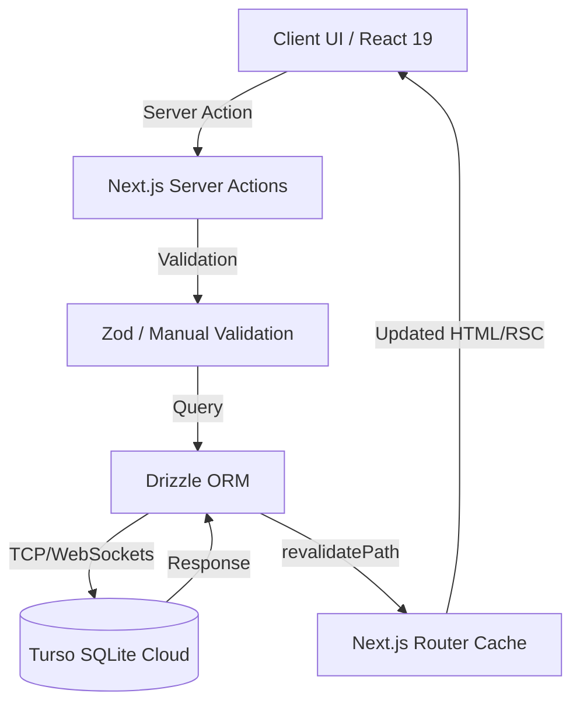

# System Architecture

My Tracker uses a modern Next.js 15 Server-First architecture, eliminating traditional REST APIs in favor of Server Actions and tightly coupled Server Components.

## Core Flow

## Architectural Decisions
1. **URL-Driven State (`nuqs`):** View toggles (Board vs. List) and priority filters are stored in the URL search params. This allows deep-linking and prevents hydration mismatches.
2. **Server Actions for Mutations:** Form submissions (`useActionState`) and interactive UI updates (`useTransition`) trigger Server Actions, which revalidate paths upon completion.
3. **Isolated Bucket Model:** The root `/` active board only queries tasks where `projectId` is `null`. Project-specific tasks live exclusively on their respective project dashboards.
4. **No API Routes:** There are no traditional `/api/` endpoints. All data fetching is done directly in Server Components, and mutations are handled by `src/actions/`.