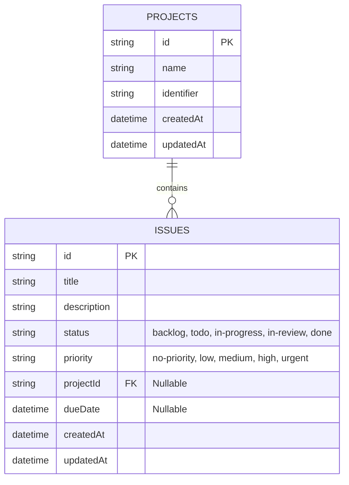

# Database Schema & Data Flow

My Tracker uses **Turso (libSQL)** managed by **Drizzle ORM**. 

## Entity Relationship Diagram

## Data Lifecycle & Quirks
* **Soft Unlinking:** Deleting a project does **not** cascade-delete issues. The `deleteProject` action runs an `UPDATE` setting `projectId: null` for all associated issues before deleting the project, returning them to the global unassigned bucket.
* **The Global Bucket:** The main active issues query explicitly uses `isNull(issues.projectId)`.